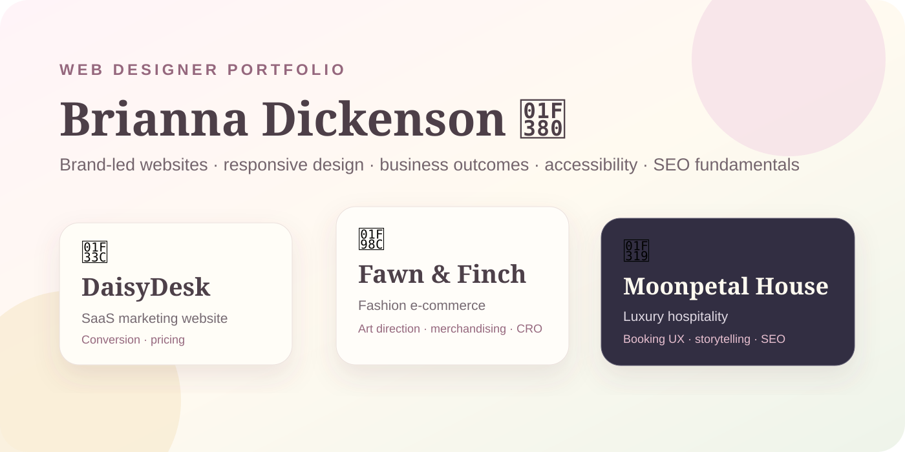
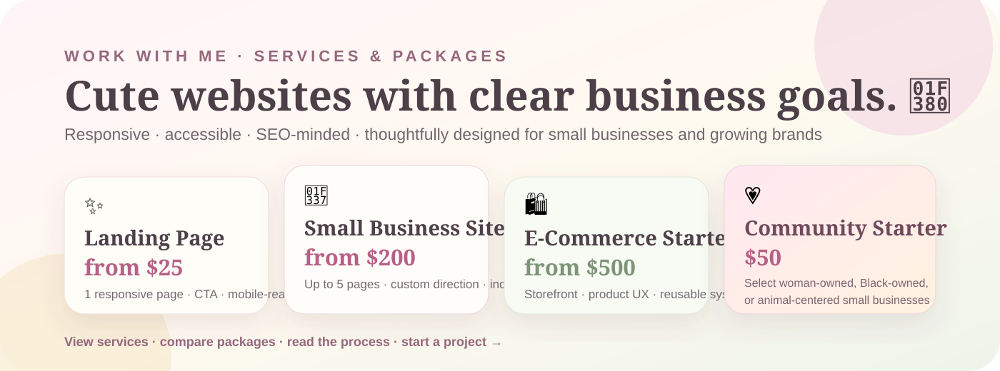
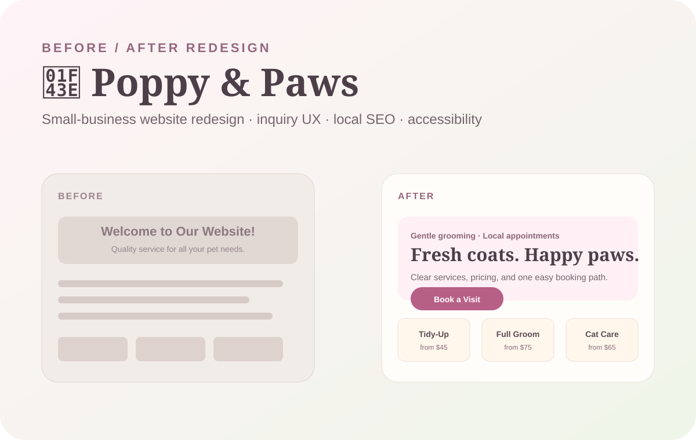

# 🎀 Brianna Dickenson 🎀

## **Web Designer | Responsive Websites · Brand-Led Digital Experiences**

I design and build polished, accessible websites that combine **distinctive visual direction** with clear content hierarchy, responsive behavior, business goals, SEO/accessibility fundamentals, and production-ready implementation.



---

## 💌 Work With Me

🕓 **Seeking Full Time Remote Position**  [](https://www.linkedin.com/in/brianna-dickenson-9555515b)

💌 **Available For Freelance** [](mailto:breyhanadickenson@gmail.com?subject=Web%20Design%20Project%20Inquiry)

🌐 **[View Portfolio Microsite](https://breyhanaariel.github.io/web-designer/)**

I take on focused short-term website work including landing pages, small-business websites, e-commerce storefronts, redesigns, responsive/accessibility cleanup, and SEO-minded content structure.

[](https://breyhanaariel.github.io/web-designer/services.html)

🌷 **[View Services, Packages & Project Inquiry →](https://breyhanaariel.github.io/web-designer/services.html)**  
💌 **[Send a Project Inquiry →](https://breyhanaariel.github.io/web-designer/services.html#inquiry)**  
Prefer email? [breyhanadickenson@gmail.com](mailto:breyhanadickenson@gmail.com?subject=Web%20Design%20Project%20Inquiry)

---

## 🧠 Core Stack

**Web Design:** Responsive websites · landing pages · small-business websites · e-commerce · redesigns · reusable web systems  
**Visual Direction:** Art direction · typography · color systems · layout hierarchy · brand expression · editorial web design  
**Business & Conversion:** Offer clarity · service/package structure · inquiry flows · booking UX · merchandising · conversion-minded CTAs  
**Search & Performance:** SEO/AEO-minded information architecture · metadata planning · descriptive content structure · responsive assets · performance-aware UI  
**Accessibility:** WCAG 2.2-informed design · semantic structure · keyboard/focus states · contrast · form labels · reduced motion  
**Build:** HTML5 · CSS3 · JavaScript · TypeScript · React · Next.js  
**Tools:** Figma · FigJam · Adobe Creative Cloud · Git · GitHub · Vercel

---

## 🌷 Featured Work

### 🎨 Designs

<table>
<tr>
<td width="260" valign="top"><br><br><a href="https://daisydesk.vercel.app">🌐 Live Site</a> · <a href="./daisydesk/README.md">📖 Case Study</a></td>
<td valign="top">
<h3>🌼 DaisyDesk — Small-Business Client Management SaaS</h3>
<p>SaaS Marketing | Product storytelling, pricing hierarchy, conversion, responsive design</p>
<p>A cheerful client-management website for freelancers and small service businesses managing leads, projects, appointments, proposals, invoices, and follow-ups.</p>
<p><strong>Demonstrates:</strong> SaaS positioning · marketing hierarchy · interactive product storytelling · pricing UX · conversion-focused CTAs · accessible interaction patterns</p>
<p><strong>Design &amp; Build:</strong> Figma · Next.js · React · TypeScript · responsive CSS · accessibility · SEO-minded structure</p>
<p><strong>Business goal:</strong> Make a multi-feature product understandable quickly so small businesses can recognize fit, explore the product, and reach pricing/demo decisions with less confusion.</p>
</td>
</tr>
</table>

<table>
<tr>
<td width="260" valign="top"><br><br><a href="https://fawn-and-finch.vercel.app">🌐 Live Site</a> · <a href="./fawn-and-finch/README.md">📖 Case Study</a></td>
<td valign="top">
<h3>🦌 Fawn &amp; Finch — Animal-Inspired Fashion &amp; Accessories</h3>
<p>Fashion E-Commerce | Art direction, merchandising, CRO, responsive commerce</p>
<p>A romantic accessories label translating woodland inspiration into editorial product storytelling, curated collections, and a polished mobile shopping experience.</p>
<p><strong>Demonstrates:</strong> e-commerce art direction · product discovery · filtering · merchandising · product-detail communication · saved items · mobile shopping flows</p>
<p><strong>Design &amp; Build:</strong> Figma · Next.js · React · TypeScript · responsive commerce UI · accessibility · SEO-minded structure</p>
<p><strong>Business goal:</strong> Build brand desirability without making shopping harder, supporting discovery, trust, product consideration, and clear purchase paths.</p>
</td>
</tr>
</table>

<table>
<tr>
<td width="260" valign="top"><br><br><a href="https://moonpetal-house.vercel.app">🌐 Live Site</a> · <a href="./moonpetal-house/README.md">📖 Case Study</a></td>
<td valign="top">
<h3>🌙 Moonpetal House — Luxury Boutique Hotel &amp; Retreat</h3>
<p>Luxury Hospitality | Editorial storytelling, booking UX, SEO, responsive design</p>
<p>A dreamy countryside retreat built around restorative stays, garden dining, wellness rituals, and quiet seasonal experiences.</p>
<p><strong>Demonstrates:</strong> hospitality art direction · editorial layouts · room discovery · booking-intent flows · local/search-minded content structure · responsive typography and motion</p>
<p><strong>Design &amp; Build:</strong> Figma · Next.js · React · TypeScript · responsive CSS · reduced motion · SEO/content structure</p>
<p><strong>Business goal:</strong> Create desire for the property while keeping room information and booking intent easy to find, moving visitors from inspiration toward booking with less uncertainty.</p>
</td>
</tr>
</table>

### ✨ Redesigns

<table>
<tr>
<td width="260" valign="top"><br><br><a href="https://breyhanaariel.github.io/web-designer/redesign.html">🌐 Live Redesign Study</a> · <a href="./redesign-study/README.md">📖 Case Study</a></td>
<td valign="top">
<h3>🐾 Poppy &amp; Paws — Small-Business Website Redesign</h3>
<p>Local Small Business | Before/after strategy, inquiry UX, local SEO, accessibility</p>
<p>A fictional before/after redesign showing how a cluttered local-service website can become easier to understand, easier to trust, easier to find, and easier to contact.</p>
<p><strong>Before:</strong> buried services · competing CTAs · weak mobile hierarchy · vague local information · generic visual identity</p>
<p><strong>After:</strong> clear packages + starting-price context · one primary booking path · service-area/FAQ structure · accessibility fundamentals · stronger brand hierarchy</p>
<p><strong>Demonstrates:</strong> redesign strategy · content hierarchy · local/SEO clarity · responsive cleanup · inquiry optimization · accessibility fundamentals</p>
<p><strong>Business goal:</strong> Generate clearer, better-qualified inquiries while reducing pre-contact confusion and making services easier to compare.</p>
<p><em>Concept redesign — no real client results, traffic, testimonials, or conversion metrics are claimed.</em></p>
</td>
</tr>
</table>

---

## ♿ Accessibility, SEO & Website Quality

| Project | Accessibility Evidence | SEO / Search Evidence | Production Evidence |
| --- | --- | --- | --- |
| [DaisyDesk](./daisydesk/README.md) | Semantic landmarks · keyboard-operable tabs · ARIA state · reduced-motion support | Metadata · sitemap · robots · descriptive product/content hierarchy | Live deployment · lint · TypeScript · production build |
| [Fawn & Finch](./fawn-and-finch/README.md) | Real controls · ARIA filter state · live region updates · reduced-motion support | Metadata · sitemap · robots · structured product/collection content | Live deployment · lint · TypeScript · production build |
| [Moonpetal House](./moonpetal-house/README.md) | Labeled booking controls · status feedback · logical responsive reading order · reduced motion | Metadata · sitemap · robots · room/service/local-content architecture | Live deployment · lint · TypeScript · production build |
| [Poppy & Paws](./redesign-study/README.md) | Contrast/focus/form-label strategy · larger controls · semantic restructuring | Local/service headings · FAQ strategy · clearer business/service context | Live before/after study · documented redesign decisions |

The showcase work targets **WCAG 2.2-informed AA design**. Formal third-party conformance is not claimed, and I do not invent Lighthouse scores or business metrics that have not been measured.

---

## ✅ Production Quality

The three coded showcase sites use the same repeatable quality checks:

```bash
npm run lint
npm run typecheck
npm run build
```

GitHub Actions verifies dependency installation, linting, TypeScript, and production builds. Each showcase is independently deployed so recruiters and clients can review the actual responsive experience rather than only static mockups.

[View the final recruiter/client and production QA review](./docs/FINAL_REVIEW.md).

---

## 🌈 How I Work

1. **Understand** — define the business, audience, offer, constraints, and success criteria.
2. **Structure** — map content hierarchy, navigation, page goals, and conversion paths.
3. **Art Direct** — establish typography, color, imagery, layout rhythm, and brand expression.
4. **Design** — create responsive interfaces with clear states and reusable patterns.
5. **Build** — translate the approved system into production-ready front-end code.
6. **QA & Refine** — review responsiveness, accessibility, content, interaction, and performance.

---

## 🌸 Explore My Work

My portfolio is intentionally separated by specialty so each discipline can tell a focused story while still showing how my design and development skills connect.

- 🎀 [UI/UX Designer](https://breyhanaariel.github.io/ui-ux-designer/) — product design, research, flows, design systems, prototyping, and developer handoff
- 💻 [Front-End Developer](https://breyhanaariel.github.io/front-end-developer/) — React, Next.js, TypeScript, APIs, state management, testing, accessibility, and measured performance
- 🌐 **Web Designer** — responsive websites, redesigns, e-commerce, SEO/accessibility fundamentals, and business-focused client work
- 🎨 [Graphic Designer](https://breyhanaariel.github.io/graphic-designer/) — brand identity, campaign design, marketing assets, print, and motion
