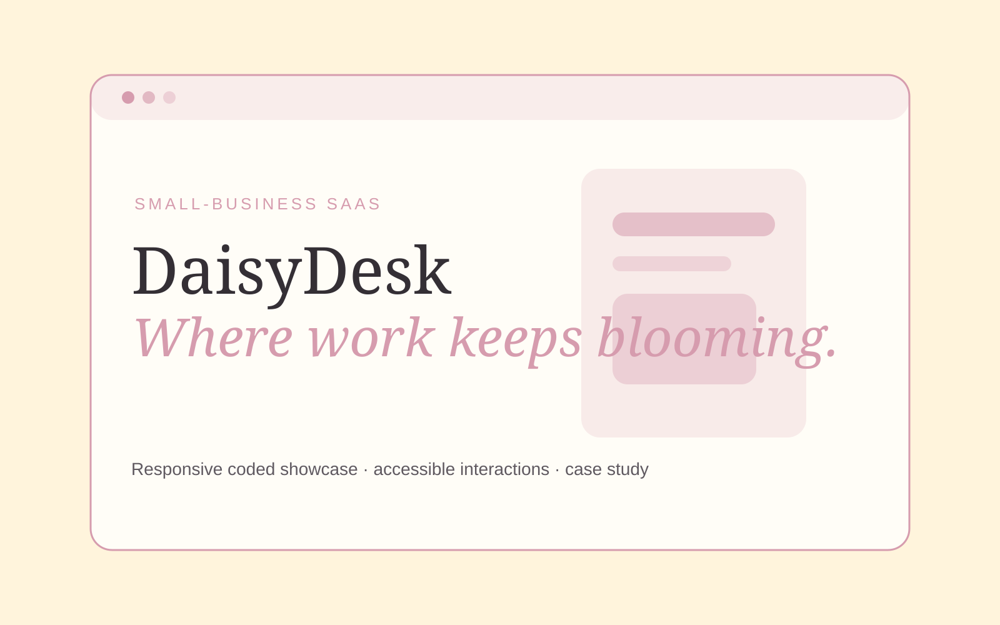

# 🌼 DaisyDesk — Small-Business Client Management SaaS

> **Self-Directed Concept Project** — DaisyDesk is fictional. The business, product, pricing, dashboard data, customers, and outcomes shown here are portfolio concepts, not claims about a real client or live SaaS product.

**Website type:** B2B / small-business SaaS marketing website  
**Role:** Web Designer + Front-End Implementation  
**Stack:** Next.js · React · TypeScript · CSS  
**Status:** Interactive coded concept  
🌐 **Live Site:** [daisydesk.vercel.app](https://daisydesk.vercel.app)  
🎨 **Design:** [Figma presentation board](https://www.figma.com/design/V7zFfK9MJRNt9j8uOhuamk?node-id=1-2)

## 🌷 Concept

**DaisyDesk** is a cheerful client-management platform for freelancers and small service businesses. Its fictional product brings leads, projects, appointments, proposals, invoices, and follow-ups into one approachable workspace.

The design challenge is to make capable business software feel **clear and trustworthy without becoming cold, corporate, or visually generic**.

## 💭 The Design Problem

Many small-business owners need structure but do not identify with enterprise software. DaisyDesk explores how a SaaS marketing website can communicate practical depth while preserving warmth, personality, and a low-stress first impression.

This is a design hypothesis, not a finding from original user research.

## 🎯 Goals

- Communicate the product value within the first hero viewport.
- Make multiple business functions feel like one understandable workflow.
- Use a distinctive feminine/cozy identity without compromising legibility or professional credibility.
- Create conversion paths for exploration and pricing without aggressive dark patterns.
- Build the concept as a real responsive site rather than a static mockup.

## 📈 Business Goal → Design Decision → Intended Impact

| Business goal | Design decision | Intended business impact |
|---|---|---|
| Help visitors understand the product quickly | Put an interactive product preview in the hero instead of relying on abstract marketing copy | Reduce initial confusion and encourage deeper product exploration |
| Make a multi-feature product feel manageable | Organize features around the client lifecycle: leads, projects, appointments, proposals, invoices, and follow-ups | Help very small businesses recognize their own workflow and product fit |
| Make pricing feel approachable | Use plain-language tiers, clear inclusions, and a monthly/yearly toggle | Reduce pricing uncertainty and help visitors compare options without sales pressure |
| Support trust across devices and abilities | Use semantic structure, keyboard-operable controls, responsive layouts, visible focus states, and reduced-motion support | Make the marketing experience usable by more prospective customers and reinforce product credibility |

These are **intended outcomes and hypotheses**, not measured conversion results.

## 👥 Intended Audience

The concept is designed around plausible needs of solo service providers and very small teams: photographers, designers, beauty professionals, consultants, event professionals, and other appointment/project-based businesses.

## 🗺 Information Architecture

The implemented homepage currently includes:

1. Hero + interactive product preview
2. Product capability strip
3. Feature/value cards
4. Four-step workflow
5. Pricing concept with monthly/yearly interaction
6. Clear concept disclosure

**Implemented expansion:** Features · Solutions · Pricing · Resources · Customer Story · About · Demo.

## 🎨 Art Direction

**Personality:** sunny · capable · friendly · organized · encouraging  
**Palette:** butter yellow · petal pink · soft mint · warm cream · cocoa ink  
**Type direction:** expressive editorial serif for emotional hierarchy + clean system sans-serif for product clarity  
**Shape language:** rounded cards, soft pills, floral micro-motifs, generous whitespace  
**Motion:** subtle and optional; interaction should never depend on animation

## 🧩 Design System

### Core tokens
- Cream: `#fffaf0`
- Paper: `#fffdf7`
- Butter: `#f6d978`
- Petal: `#f4b8c7`
- Mint: `#bcdcc9`
- Ink: `#3f3a35`

### Reusable patterns
- Pill CTAs
- Floral brandmark
- Rounded information cards
- Tabbed product preview
- Statistic cards
- Workflow rows
- Pricing cards and billing toggle

## ✨ Interactive Prototype Details

The current coded homepage includes:
- A keyboard-operable product-preview tab set
- Live content changes between **Today / Clients / Money**
- Monthly/yearly pricing-state toggle
- Responsive in-page navigation
- Reduced-motion support

The dashboard numbers and prices are explicitly concept data.

## ♿ Accessibility Approach

- Semantic landmarks and heading order
- Visible native focus behavior retained
- Real buttons for interactive state changes
- `aria-selected` on product-preview tabs
- Text remains available without hover
- Layout collapses cleanly for narrow screens
- `prefers-reduced-motion` respected
- Decorative floral marks are hidden from assistive technology where appropriate

Target: **WCAG 2.2-informed AA design**, to be verified with formal checks before final publication.

## 💌 Conversion Thinking

Current hypotheses to validate in a real engagement:
- A product preview in the hero may explain value faster than an abstract lifestyle illustration.
- Mapping features to the full client lifecycle may reduce perceived complexity.
- Plain-language pricing tiers may feel more approachable to very small businesses.
- Warm visual identity can differentiate the product without weakening professional trust if hierarchy remains disciplined.

No conversion lift is claimed.

## 💻 Run Locally

```bash
cd daisydesk
npm install
npm run dev
```

Open `http://localhost:3001`.

Quality commands:

```bash
npm run lint
npm run typecheck
npm run build
```

## 🖼 Portfolio Visuals



- ✅ Permanent GitHub hero artwork
- ✅ Figma presentation board
- ✅ Live production deployment
- ✅ Responsive multi-page coded experience
- ✅ Social sharing preview artwork

## ✅ Production QA

- GitHub Actions: install ✅ · lint ✅ · TypeScript ✅ · production build ✅
- Production homepage verified ✅
- Key deeper routes verified ✅
- Responsive CSS breakpoints implemented ✅
- Reduced-motion handling implemented ✅
- Sitemap + robots metadata implemented ✅
- Open Graph / social metadata implemented ✅

## 🌱 Next Iteration

If developed beyond a portfolio concept, the next meaningful step would be real user research and usability testing rather than adding more speculative screens.
