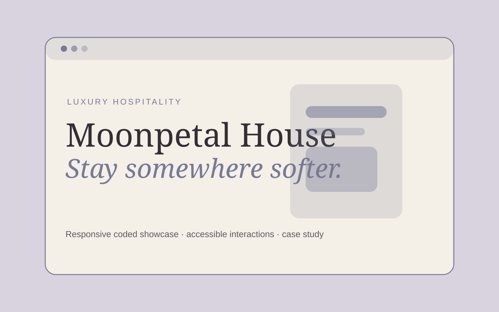

# 🌙 Moonpetal House — Luxury Boutique Hotel & Retreat

> **Self-Directed Concept Project** — Moonpetal House is fictional. The property, rooms, experiences, restaurant, prices/availability, location, and booking inventory are not real.

**Website type:** Luxury boutique hospitality / retreat  
**Role:** Web Designer + Front-End Implementation  
**Stack:** Next.js · React · TypeScript · CSS  
**Status:** Interactive coded concept  
🌐 **Live Site:** [moonpetal-house.vercel.app](https://moonpetal-house.vercel.app)  
🎨 **Design:** [Figma presentation board](https://www.figma.com/design/V7zFfK9MJRNt9j8uOhuamk?node-id=2-2)

## 🌷 Concept

**Moonpetal House** is an imagined twelve-room countryside retreat centered on restorative stays, garden dining, warm-water rituals, and unhurried seasonal experiences.

The website is designed to prove that an immersive luxury-hospitality experience can still preserve **booking clarity, responsive usability, accessibility, and content structure**.

## 💭 The Design Problem

Hospitality websites often need to sell an emotional place before a guest can physically experience it. Highly editorial art direction can create desire—but can also obscure room information, navigation, or booking actions.

Moonpetal House explores the balance between atmosphere and task completion.

## 🎯 Goals

- Establish a premium sense of place immediately.
- Keep booking intent visible without interrupting storytelling.
- Present rooms, wellness, dining, and editorial content as one coherent brand world.
- Use motion/atmosphere as enhancement rather than required interaction.
- Build a responsive coded site suitable for eventual independent deployment.

## 👥 Intended Audience

A design-conscious leisure traveler looking for a small, restorative property, romantic weekend, quiet celebration, or wellness-focused stay.

This is a concept audience, not a research-backed persona.

## 🗺 Information Architecture

Implemented homepage:
1. Immersive hero
2. Availability-intent form
3. Brand/property introduction
4. Interactive Stay / Wellness / Table exploration
5. Room discovery
6. Dining story
7. Journal/editorial preview
8. Concept disclosure

**Implemented expansion:** Rooms · Individual Room · Wellness · Dining · Experiences · Journal · Events · Location · Contact · Booking handoff.

## 🎨 Art Direction

**Personality:** moonlit · restorative · intimate · literary · quietly luxurious  
**Palette:** midnight blue · dusty lavender · warm cream · faded rose · garden sage  
**Typography:** expressive classic serif + minimal uppercase sans-serif metadata  
**Image direction:** low light, garden shadows, linen, stone, water, candlelight, seasonal close crops  
**Motion:** slow, optional, reduced-motion safe

## ✨ Current Interactions

- Functional date/guest booking-intent form
- Clear demo availability response instead of fake inventory
- Interactive **Stay / Wellness / Table** content tabs
- Responsive room and editorial sections
- In-page navigation
- Reduced-motion support

## 🔎 SEO / Content Strategy

Planned real-world information architecture would support:
- Property and destination intent
- Individual room pages
- Wellness and dining service pages
- Local-area content
- Events/private-hire content
- Structured FAQs and descriptive page titles

No local-search ranking is claimed because the property does not exist.

## ♿ Accessibility Approach

- Semantic form labels and native date/select controls
- Real buttons for interactive tabs
- `aria-selected` state on the experience switcher
- Booking-demo feedback uses `role="status"`
- No critical content hidden behind hover
- Responsive reading order stays logical
- Reduced-motion preference respected
- Decorative atmosphere elements are separated from informational copy

Target: **WCAG 2.2-informed AA design**, with formal validation planned after deployment.

## 💌 Booking / Conversion Hypotheses

Ideas to validate on a real hospitality project:
- Persistent but restrained booking access may preserve conversion without reducing perceived luxury.
- Room storytelling should pair emotional naming with concrete descriptive detail.
- Dining/wellness content can support stay desirability while providing separate conversion paths.
- Editorial journal content can extend the property's world and support organic discovery if it remains useful rather than decorative.

No booking increase is claimed.

## 💻 Run Locally

```bash
cd moonpetal-house
npm install
npm run dev
```

Open `http://localhost:3003`.

## 🖼 Portfolio Visuals



- ✅ Permanent GitHub hero artwork
- ✅ Figma presentation board
- ✅ Live production deployment
- ✅ Responsive multi-page coded experience
- ✅ Social sharing preview artwork

## ✅ Production QA

- GitHub Actions: install ✅ · lint ✅ · TypeScript ✅ · production build ✅
- Production homepage verified ✅
- Key deeper routes verified ✅
- Responsive CSS breakpoints implemented ✅
- Reduced-motion handling implemented ✅
- Sitemap + robots metadata implemented ✅
- Open Graph / social metadata implemented ✅

## 🌱 Next Iteration

If developed beyond a portfolio concept, the next meaningful step would be real property photography/content and validation of booking/accessibility needs with actual guests.
